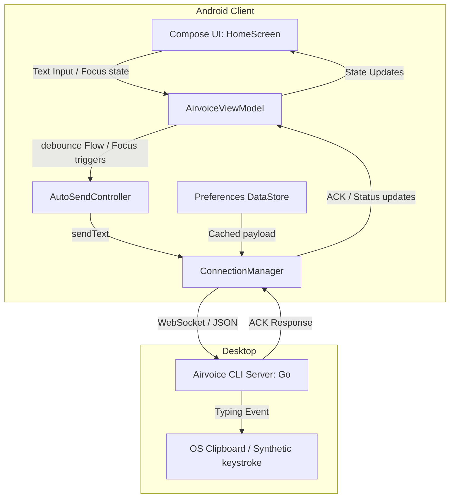

# Airvoice Android Client Design Specification

**Date**: 2026-06-25  
**Status**: APPROVED / PROPOSED FOR IMPLEMENTATION

---

## 1. Introduction & Goals

This document specifies the architecture, dependencies, and implementation details for the **Android Client** of Airvoice. The Android client will act as a direct functional counterpart to the existing iOS client: a lightweight bridge allowing users to voice-dictate (using their system input method) or type on their Android phone, which then instantly transmits the text over the local network (LAN) to the Airvoice CLI server to be pasted at the computer cursor.

### Key Objectives
* **Aesthetic & Structural Parity**: 1:1 functional parity and directory-structure symmetry with the iOS SwiftUI project.
* **Pure Native Performance**: Written in Kotlin with Jetpack Compose, targeting Android 8.0 (API 26) as baseline (minSDK 21 supportable for Compose) and targetSDK 34+.
* **Google Play Services Independence**: Use offline-capable CameraX and Google ML Kit Barcode Scanning so the client functions seamlessly on standard Android, AOSP, HarmonyOS, and de-Googled ROMs.
* **Robust LAN Communication**: Use OkHttp WebSocket with custom reconnection and heartbeat logic to ensure reliable LAN connections.

---

## 2. System Architecture & Data Flow



---

## 3. Directory Layout & Module Structure

The Android project will live in the `android/` directory at the root of the workspace. Its internal package structure is designed to match the iOS client structure (`Models`, `Services`, `Views`, `Utilities`):

```text
android/
├── app/
│   ├── build.gradle.kts          # Dependencies: OkHttp, CameraX, ML Kit, Compose, DataStore, Serialization
│   └── src/main/
│       ├── AndroidManifest.xml   # Camera, Internet, and Vibrator permissions
│       └── java/com/yule/airvoice/
│           ├── AirvoiceApplication.kt  # App-level entry point
│           ├── MainActivity.kt         # Launcher Activity (initializes ViewModel, requests permissions)
│           │
│           ├── models/                 # Wire protocol models (Matches iOS Models)
│           │   ├── PairingPayload.kt   # JSON parser for QR code connection settings
│           │   └── ProtocolMessage.kt  # JSON serialization for WebSocket commands
│           │
│           ├── services/               # Core business services (Matches iOS Services)
│           │   ├── ConnectionManager.kt  # WebSocket connection handler (OkHttp based)
│           │   └── AutoSendController.kt # Coroutine-based 1.5s idle debounce and keyboard monitor
│           │
│           ├── ui/
│           │   ├── theme/              # Typography, Colors, Theme definitions
│           │   ├── viewmodel/
│           │   │   └── AirvoiceViewModel.kt # State holder and coordinator
│           │   └── screens/            # Jetpack Compose UI (Matches iOS Views)
│           │       ├── MainScreen.kt        # Page switcher (Onboarding / Scanner / Home)
│           │       ├── OnboardingScreen.kt  # Set up instruction guide
│           │       ├── QRScannerScreen.kt   # CameraX camera surface + ML Kit barcode analyzer
│           │       └── HomeScreen.kt        # Connection status indicator + Multiline TextField
│           │
│           └── utils/
│               └── VibratorHelper.kt   # Tactile haptic feedback manager (Matches iOS Toast/Vibe)
```

---

## 4. Wire Protocol Compatibility

The client will serialize and deserialize messages in standard JSON over a WebSocket connection.

### 4.1 Pairing QR JSON Payload
When the scanner reads the terminal QR code, it decodes this JSON format:
```json
{
  "v": 1,
  "ws": "ws://192.168.1.42:7383/ws",
  "token": "uuid-token"
}
```

### 4.2 Messages (Client → Server)
* **Hello handshake**:
  ```json
  { "type": "hello", "device": "Android Phone", "app": "0.1.0" }
  ```
* **Text packet**:
  ```json
  { "type": "text", "id": "message-uuid", "content": "Hello from Android!", "ts": 1710000000 }
  ```
* **Ping packet** (sent if connection is idle to verify link):
  ```json
  { "type": "ping" }
  ```

### 4.3 Messages (Server → Client)
* **Hello handshake**:
  ```json
  { "type": "hello", "host": "computer-hostname", "version": "0.1.0" }
  ```
* **Acknowledgment packet**:
  ```json
  { "type": "ack", "id": "message-uuid", "ok": true }
  ```
* **Pong packet**:
  ```json
  { "type": "pong" }
  ```

---

## 5. Component Implementations

### 5.1 ConnectionManager (`services/ConnectionManager.kt`)
* Manages `WebSocket` instance from OkHttp.
* Exposes connection status via a StateFlow `val status: StateFlow<ConnectionStatus>` containing:
  * `Disconnected`
  * `Connecting`
  * `Connected(host: String)`
  * `Error(message: String)`
* **Reconnection Policies**: If WebSocket closes unexpectedly, attempt to reconnect using exponential backoff (e.g., delay `2s -> 4s -> 8s -> 16s` up to a maximum of 30 seconds). Reset backoff upon successful handshake.
* **Keep-alive (Heartbeat)**: Configures OkHttp's built-in `pingInterval(15, TimeUnit.SECONDS)` to maintain low-level TCP/WebSocket connection health.

### 5.2 AutoSendController (`services/AutoSendController.kt`)
* **Idle Debounce**: Uses Kotlin Coroutines' `flow.debounce(1500L)` on the input text Flow. When the text remains unchanged for 1.5 seconds and is not empty, trigger `sendText()`.
* **Keyboard-Hide Trigger**: Monitors `WindowInsets.isImeVisible`. If `isImeVisible` goes from `true` to `false` and there is unsent text, immediately trigger `sendText()` (without waiting for the 1.5s idle debounce).
* **In-Flight Lock**: Sets a boolean `isSending` to true when a text packet is sent. Ignore subsequent automatic send requests until `ack` is received, or a 5-second timeout occurs.
* **Deduping**: Stores `lastAckedText`. If the text editor content matches `lastAckedText`, do not re-send.
* **Post-Ack Action**:
  * On `ack.ok == true`: Trigger device vibration, show a quick Toast "已发送到电脑" (Sent to computer), and clear the editor field.
  * On `ack.ok == false`: Retain text in the editor, and display an error Toast.

### 5.3 QRScanner (`ui/screens/QRScannerScreen.kt`)
* Built using Android Jetpack CameraX.
* Employs `ImageAnalysis` analyzer run on a background Executor.
* Decodes frames via ML Kit:
  ```kotlin
  val scanner = BarcodeScanning.getClient()
  val inputImage = InputImage.fromMediaImage(mediaImage, rotationDegrees)
  scanner.process(inputImage)
      .addOnSuccessListener { barcodes ->
          // Extract pairing data, store to DataStore, change screen to Home
      }
  ```
* Declares `<uses-permission android:name="android.permission.CAMERA" />` in `AndroidManifest.xml` and checks/requests permissions at runtime before entering the scanner screen.

### 5.4 PreferencesStore / DataStore
* Uses **Preferences DataStore** to save connection info:
  * Key `ws_url`: WebSocket URL.
  * Key `token`: Auth token.
* On app startup, `AirvoiceViewModel` reads the DataStore. If both keys exist, it skips the onboarding/scanner screens and goes straight to the `HomeScreen`, initiating background connection.

### 5.5 VibratorHelper (`utils/VibratorHelper.kt`)
* Encapsulates haptic feedback to match iOS:
  * Android 12 (API 31)+: Plays `VibrationEffect.EFFECT_CLICK` using `VibratorManager`.
  * Pre-Android 12: Falls back to `vibrate(VibrationEffect.createOneShot(50, VibrationEffect.DEFAULT_AMPLITUDE))` using system `Vibrator`.

---

## 6. Jetpack Compose UI Screens

### 6.1 Screen Flow State Machine
The app transitions between screens based on ViewModel's `uiState.currentScreen` enum:
```kotlin
enum class Screen {
    ONBOARDING,
    SCANNER,
    HOME
}
```
If connection parameters exist in DataStore, startup screen is `HOME`. Otherwise, it is `ONBOARDING`.

### 6.2 OnboardingScreen
* A clean layout utilizing Material Design 3 cards showing connection steps.
* Features a prominent button: **"Scan Terminal QR Code"** to trigger the CameraX scanner.

### 6.3 QRScannerScreen
* Displays the camera preview overlayed with a finder rectangle UI.
* Seamless transition back to `Home` or `Onboarding` if the user cancels.

### 6.4 HomeScreen
* **Top Status bar**: Uses Material 3 styling (light/dark adaptive colors) to show network connectivity (Red/Yellow/Green indicators).
* **Editor**: A large multiline `TextField` filling the main body. Features a trailing "clear" icon.
* **Footer Button**: A large Material 3 Extended Floating Action Button (or similar styled button) labeled **"Speak / Toggle Keyboard"** (说话 / 唤起键盘) that invokes `focusRequester.requestFocus()` to bring up the system IME voice panel.

---

## 7. Verification & Testing Strategy

1. **Protocol Unit Tests**: Write unit tests to check JSON serialization/deserialization for `ProtocolMessage` and `PairingPayload`.
2. **AutoSend Flow Tests**: Use Kotlin Coroutines Test Dispatchers to verify that the 1.5s debounce works correctly and triggers sends under simulated typing delays.
3. **Mock WebSocket Server**: Setup a local test server using `okhttp3.mockwebserver.MockWebServer` to verify handshake behavior, Ack parsing, and automatic reconnection behavior.
